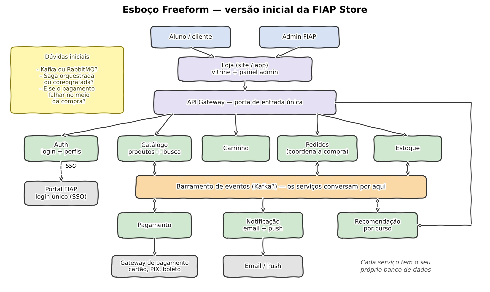
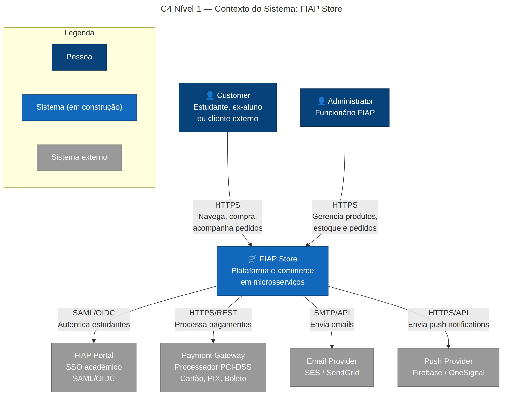
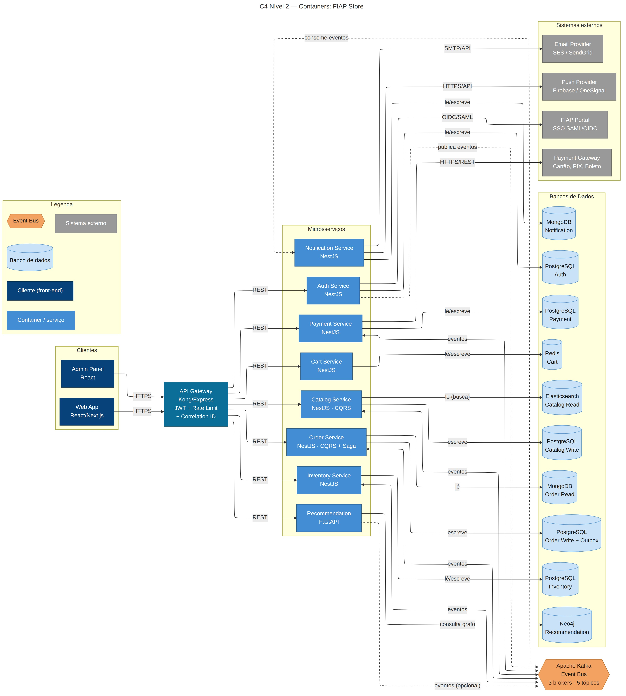
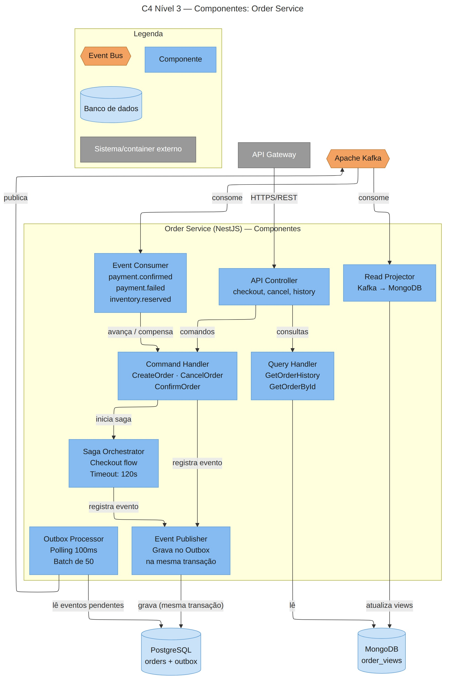
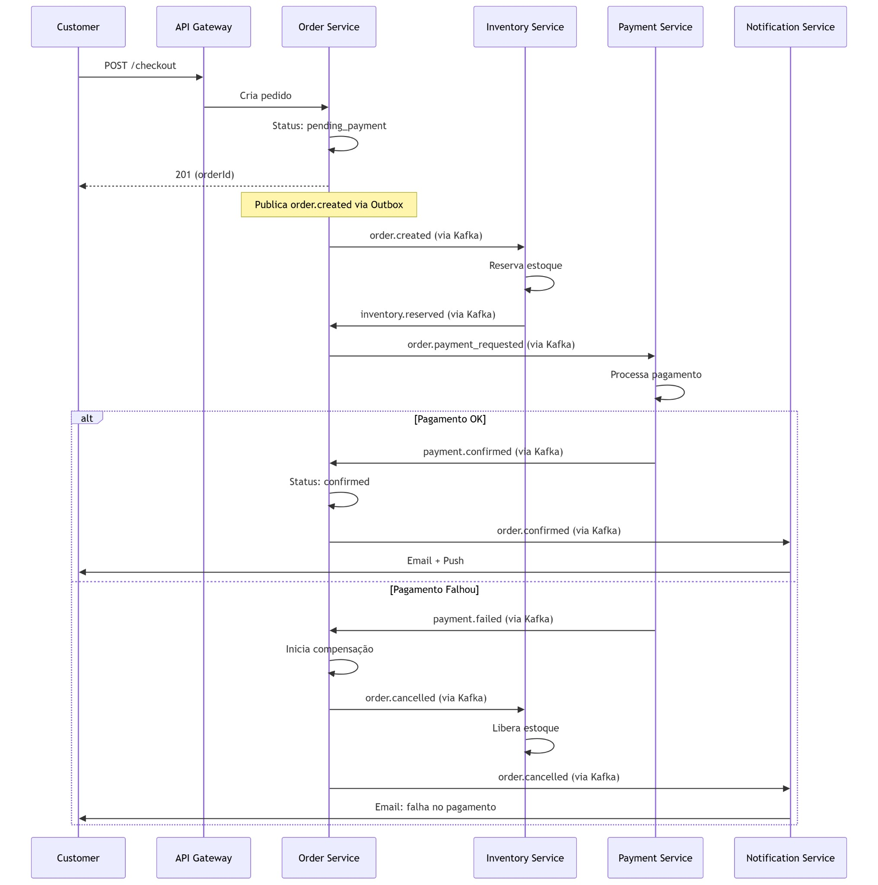

# FIAP Store — Trabalho Final de IT Architecture Design & Styles

**Disciplina:** IT Architecture Design & Styles  
**Instituição:** FIAP — Faculdade de Informática e Administração Paulista  
**Turma:** 2026  
**Professor:** Leonardo Pinho ([profleonardo.pinho@fiap.com.br](mailto:profleonardo.pinho@fiap.com.br))

## Vídeo de apresentação

> **Link do vídeo:** https://1drv.ms/f/c/594af9b6458da609/IgChuG1v6sS-QpqK8YMOTA52ASb64OK8L5nj4cUV7joJvAA?e=qjSym4

Todos os integrantes apresentam uma parte do projeto (ver tabela **Equipe** no final deste documento).

## 1. Story Telling — O Problema que Resolvemos

Quem estuda na FIAP sabe: no começo do semestre o professor indica uns 3 livros, um kit de hardware, talvez um curso extra de alguma plataforma. Aí começa a correria — um livro tá numa livraria, o kit só vende num site gringo, e o curso complementar nem é fácil de achar. Cada coisa num lugar diferente, nada conversa com nada.

A gente olhou pra isso e pensou: e se a FIAP tivesse uma loja própria? Um lugar onde o aluno de Engenharia de Software já vê na home o livro que o professor dele vai pedir, enquanto o pessoal de Data Science encontra sensor IoT e curso de ML. Tudo com login do portal (sem criar conta nova), pagamento que brasileiro usa de verdade (PIX, boleto, cartão) e recomendações que fazem sentido para o semestre atual.

Nasceu a **FIAP Store**. Na prática, a gente construiu uma plataforma completa de e-commerce pra poder estudar arquitetura de microsserviços — com eventos, Sagas, CQRS e tudo mais. O produto é real, mas o objetivo principal é aprender fazendo.

**Tema:** E-commerce (tema sugerido pelo professor) — microsserviços com comunicação por eventos para um e-commerce educacional.

## 2. O que Esperamos Aprender

Beleza, mas o que a gente quer tirar disso tudo? Não é só codar e entregar. O projeto inteiro foi pensado pra gente passar por situações que no mercado de trabalho aparecem o tempo todo:

1.  **Microsserviços de verdade** — Não tutorial de blog com 2 serviços. São 8, cada um com banco próprio, pipeline próprio. A gente queria sentir na pele quando isso ajuda e quando só atrapalha.

2.  **Eventos e Kafka** — Publicar mensagem e torcer pro consumer fazer o trabalho dele. Lidar com mensagem duplicada, fora de ordem, consumer que morreu no meio.

3.  **CQRS** — Parece lindo separar leitura de escrita. Até você perceber que o dado pode ficar 5 segundos desatualizado e o usuário reclama.

4.  **Modelo C4** — Aprender a desenhar arquitetura de um jeito que gente técnica E não-técnica entende.

5.  **Dor de sistema distribuído** — Saga que trava, compensação que não roda, circuit breaker que abre na hora errada. Isso não dá pra aprender lendo.

6.  **E-commerce sob pressão** — Controlar estoque quando 200 pessoas compram ao mesmo tempo, não cobrar ninguém duas vezes, não guardar número de cartão.

## 3. Perguntas que Precisam ser Respondidas

Antes de escrever código, sentamos e listamos tudo que a gente não sabia resolver. Foram 18 perguntas no total, organizadas por área — abaixo estão as principais. Conseguimos responder 14 delas com convicção, 3 ainda estamos investigando, e 1 ficou aberta (multi-tenancy pra múltiplos campi — foge do escopo por enquanto).

**Sobre dados:** Como manter consistência sem transação distribuída? E se o read model ficar desatualizado? Como evitar vender produtos que não tem?

**Sobre escala:** Como escalar só o serviço que está sofrendo? Kafka aguenta o pico? Busca no catálogo fica rápida com 10k produtos?

**Sobre integração:** Como funciona o SSO com o portal da FIAP? E se o gateway de pagamento cair? APIs mudam — como não quebrar quem consome?

**Sobre segurança:** Cartão de crédito — como não guardar nada? LGPD — o que precisa criptografar? Input malicioso — como barrar?

**Sobre operação:** Um bug cruza 5 serviços — como achar? Deploy sem derrubar nada? Rede falha — e aí?

**Sobre escopo:** Como suportar multi-tenancy para múltiplos campi? (pergunta em aberto — foge do escopo por enquanto)

Para cada pergunta respondida, documentamos: o que avaliamos, o que escolhemos e o que abrimos mão (trade-off).

## 4. Nossos Principais Riscos

| **ID** | **Risco**                               | **Prob.** | **Impacto** |
|--------|-----------------------------------------|-----------|-------------|
| RT-001 | Kafka cai e comunicação assíncrona para | Média     | Crítico     |
| RT-002 | Read model dessincronizado (CQRS)       | Alta      | Alto        |
| RT-003 | Saga trava no meio                      | Média     | Crítico     |
| RT-004 | Sistema não aguenta pico de matrícula   | Alta      | Alto        |
| RO-001 | Gateway de pagamento indisponível       | Média     | Crítico     |
| RO-002 | FIAP Portal offline                     | Média     | Alto        |
| RO-003 | Falha de backup                         | Baixa     | Crítico     |
| RS-001 | Vazamento de dados (data breach)        | Baixa     | Crítico     |
| RS-002 | Escalação de privilégios                | Baixa     | Crítico     |
| RS-003 | DDoS no API Gateway                     | Média     | Alto        |

## 5. Plano de Aprendizagem (Research Spikes)

Ninguém do time tinha experiência com Kafka, e a maioria nunca tinha feito CQRS fora de tutorial. Então antes de sair codando, paramos pra estudar direito. Chamamos de "spikes" — investigações curtas com objetivo claro:

| **O que investigamos**              | **Quanto tempo** | **O que descobrimos**                                                                                                               |
|-------------------------------------|------------------|-------------------------------------------------------------------------------------------------------------------------------------|
| Kafka vs RabbitMQ                   | 3 dias           | Kafka ganhou pelo replay de eventos (a gente precisa disso pro CQRS) e pela retenção de 7 dias que salva na hora de debugar         |
| Como fazer CQRS no NestJS           | 4 dias           | Funciona bem com @nestjs/cqrs, mas só vale a pena onde leitura e escrita são realmente diferentes. Aplicamos só em 2 dos 8 serviços |
| Saga orquestrada vs coreografada    | 4 dias           | Orquestrada é mais fácil de monitorar e entender quando dá ruim. Coreografada fica bonita mas debugar é sofrimento                  |
| Modelo C4 + Mermaid                 | 2 dias           | Mermaid resolve — versiona junto com código, renderiza no GitHub, sem ferramenta paga                                               |
| Integração com gateway de pagamento | 3 dias           | Nunca tocar em número de cartão. Tokenização no frontend, webhook idempotente, circuit breaker pro gateway                          |

## 6. Plano de Redução de Riscos

Não adianta listar risco e não fazer nada. Atacamos os principais com POCs antes de comprometer código:

**O que testamos na prática:**

- Gateway de pagamento: sandbox com cartão, PIX e boleto funcionando. Testamos o que acontece quando dá timeout.

- Kafka: subimos 3 brokers, derrubamos 1 e vimos se o sistema segura. Segura.

- SSO: Keycloak simulando o portal da FIAP. Fluxo OIDC completo, inclusive cenário de portal fora do ar.

- CQRS sob carga: bombardeamos com 50 escritas/s e 500 leituras simultâneas. Sincronização ficou abaixo de 5 segundos.

**Se algo cair em produção:**

- Pagamento fora → pedido fica pendente, circuit breaker abre, retenta em 5 minutos

- Kafka fora → outbox continua gravando no PostgreSQL, quando Kafka volta tudo é republicado

- Portal da FIAP fora → oferece login por email/senha pra quem já tem conta vinculada

**Monitoramento:** Prometheus pras métricas, Grafana pros dashboards, Jaeger pro tracing. Alertas no Slack quando algo sai do normal.

**Como cada risco da Seção 4 é tratado:**

| **Risco**                                          | **Como reduzimos**                                                                                                                                                                                      |
|----------------------------------------------------|---------------------------------------------------------------------------------------------------------------------------------------------------------------------------------------------------------|
| RT-001 · Kafka cai e a comunicação assíncrona para | Cluster de 3 brokers (derrubamos 1 no teste e o sistema segurou) e Outbox: os eventos continuam gravados no PostgreSQL e são republicados quando o Kafka volta.                                         |
| RT-002 · Read model dessincronizado (CQRS)         | Teste de CQRS sob carga (50 escritas/s e 500 leituras): sincronização abaixo de 5 s. Aceitamos a consistência eventual de forma consciente (Seção 14) e usamos CQRS só no Catalog e no Order.           |
| RT-003 · Saga trava no meio                        | Saga orquestrada (mais fácil de monitorar), com timeout de 120 s e fluxo de compensação: libera o estoque, cancela o pedido e avisa o cliente (C4 nível 3 e diagrama de sequência, Seção 15).           |
| RT-004 · Sistema não aguenta pico de matrícula     | Escala independente por serviço, auto-scaling preventivo e desligamento de features secundárias para proteger o checkout (Seção 9). Meta de 50 pedidos/s, definida sem dado real de tráfego (Seção 14). |
| RO-001 · Gateway de pagamento indisponível         | Circuit breaker: o pedido fica pendente e o pagamento é retentado em 5 minutos. Cenário de timeout testado no sandbox; cobrança com chave de idempotência.                                              |
| RO-002 · FIAP Portal offline                       | Fallback de login por email/senha para quem já tem conta vinculada; fluxo OIDC completo testado com Keycloak, inclusive com o portal fora do ar.                                                        |
| RO-003 · Falha de backup                           | Backup automático dos bancos de dados com teste periódico de restauração, tratado na camada de infraestrutura (fora do escopo do diagrama C4 — ver Seção 13).                                           |
| RS-001 · Vazamento de dados (data breach)          | Dados sensíveis criptografados (AES-256), TLS em toda comunicação, acesso por RBAC com log de quem acessou o quê; número de cartão nunca é armazenado (tokenização).                                    |
| RS-002 · Escalação de privilégios                  | RBAC e defense-in-depth: cada serviço valida o JWT por conta própria; bloqueio após 3 falhas de login.                                                                                                  |
| RS-003 · DDoS no API Gateway                       | Rate limiting de 100 req/min no gateway e rede interna segmentada.                                                                                                                                      |

## 7. Partes Interessadas e Expectativas

**FIAP (a instituição):** Quer uma plataforma que gere receita e aumente o engajamento dos alunos. Se preocupa com LGPD e com não estragar a imagem da faculdade se algo der errado.

**Estudantes:** Querem comprar material do curso sem ficar caçando em 5 sites diferentes. PIX que funciona, recomendação que faz sentido, login pelo portal sem criar conta nova.

**Professores (que avaliam a gente):** Querem ver que a gente entende os trade-offs, que sabe justificar por que escolheu Kafka e não RabbitMQ, que o C4 tá bem feito.

**TI da FIAP:** Se um dia isso for pra produção, eles vão operar. Querem logs decentes, health checks, deploy que não depende de alguém rodando comando no terminal.

**Nós (a equipe):** Queremos aprender de verdade, ter algo bom pro LinkedIn, e tirar nota boa. Nessa ordem.

## 8. Usuários e o que Tentam Realizar

Dois perfis principais:

O **estudante** (ou ex-aluno, ou alguém de fora) quer: entrar na loja, achar o que precisa pro curso, jogar no carrinho e pagar rápido. Ele espera ver recomendações que façam sentido pro semestre dele. Se comprou, quer saber quando chega. Se deu ruim no pagamento, quer feedback claro.

O **administrador** (funcionário da FIAP) quer cadastrar produto novo sem dor de cabeça, ver quanto tem no estoque, entender quais pedidos estão pendentes, e rodar promoção sem precisar atualizar item por item.

## 9. O Pior que Pode Acontecer

Sentamos e imaginamos os piores cenários possíveis. Pra cada um, definimos o que fazemos pra evitar e o que fazemos se acontecer mesmo assim:

| **O que deu errado**                   | **Estrago**                                | **Como nos protegemos**                                                                                        |
|----------------------------------------|--------------------------------------------|----------------------------------------------------------------------------------------------------------------|
| Tudo cai junto no período de matrícula | 5000 alunos travados, vendas perdidas      | Circuit breakers isolam falhas, auto-scaling preventivo, desligamos features secundárias pra salvar o checkout |
| Dados de aluno vazam                   | Multa LGPD pesada, vergonha pública        | Dados sensíveis criptografados (AES-256), TLS em tudo, acesso controlado por RBAC, log de quem acessou o quê   |
| Cliente cobrado duas vezes             | Chargeback, perda de confiança total       | Chave de idempotência em toda cobrança, reconciliação diária automática, checagem antes de retry               |
| Vendemos produto que não existe        | Cancelamento forçado, cliente insatisfeito | Version lock no estoque, reserva com timeout, serialização quando sobram poucas unidades                       |
| Hacker invade o Gateway                | Acesso livre a tudo                        | Cada serviço valida JWT por conta própria (defense-in-depth), rede interna segmentada                          |
| Kafka morreu por completo              | Serviços não se falam mais                 | Replicação em 3 brokers, outbox garante que o banco tem a verdade (Kafka é canal, não fonte)                   |

## 10. Arquitetura e Componentes

### 10.1 Esboço Freeform (versão inicial)

Antes de formalizar qualquer coisa no C4, rabiscamos a ideia em formato livre. Essa foi a versão inicial: quem usa a loja, uma porta de entrada única (API Gateway), os serviços de negócio — cada um com o seu banco — e um barramento de eventos no meio para eles conversarem. Sem regras de notação: o objetivo era pensar em voz alta.



No post-it de dúvidas estão as perguntas que tínhamos nessa fase: Kafka ou RabbitMQ, saga orquestrada ou coreografada, e o que fazer quando o pagamento falha no meio da compra. Cada uma virou um spike de investigação (Seção 5) ou uma decisão de projeto (Seção 14), e o desenho evoluiu para os diagramas C4 da Seção 15.

### 10.2 Descrição dos componentes

8 microsserviços de negócio independentes, mais o API Gateway (porta de entrada) e o Apache Kafka (event bus), comunicando via eventos:

| **Componente**        | **Stack**                           | **Responsabilidade**                                                    |
|-----------------------|-------------------------------------|-------------------------------------------------------------------------|
| API Gateway           | Kong/Express                        | Rate limiting 100 req/min, JWT, roteamento, sanitização, correlation ID |
| Auth Service          | NestJS + PostgreSQL                 | JWT, SSO/OIDC, RBAC, bloqueio após 3 falhas                             |
| Catalog Service       | NestJS + PostgreSQL + Elasticsearch | CQRS — busca full-text P95\<200ms                                       |
| Cart Service          | NestJS + Redis                      | Carrinho TTL 30d, resposta \<300ms                                      |
| Order Service         | NestJS + PostgreSQL + MongoDB       | CQRS + Saga Orquestrada (o mais complexo)                               |
| Payment Service       | NestJS + PostgreSQL                 | Cartão tokenizado, PIX, boleto. PCI-DSS                                 |
| Inventory Service     | NestJS + PostgreSQL                 | Concorrência otimista, reserva, auditoria                               |
| Notification Service  | NestJS + MongoDB                    | Email + push, retry exponencial                                         |
| Recommendation Engine | FastAPI + Neo4j                     | Recomendações por curso via grafo                                       |
| Event Bus             | Kafka 3 brokers                     | At-least-once, retenção 7d, 3 partições/tópico                          |

**Demais elementos que aparecem nos diagramas:**

| **Elemento**                   | **Tipo**        | **Descrição**                                                                                                                                   |
|--------------------------------|-----------------|-------------------------------------------------------------------------------------------------------------------------------------------------|
| Web App (React/Next.js)        | Cliente         | Interface da loja para estudantes: navegar, comprar e acompanhar pedidos. Planejado; implementação fora do escopo (Seção 14).                   |
| Admin Panel (React)            | Cliente         | Painel do administrador: cadastrar produtos, acompanhar estoque e pedidos pendentes e rodar promoções. Planejado; implementação fora do escopo. |
| PostgreSQL                     | Banco de dados  | Dados transacionais de Auth, Catalog (escrita), Order (escrita + outbox), Payment e Inventory — um banco por serviço.                           |
| Elasticsearch                  | Banco de dados  | Read model do Catalog, usado na busca full-text.                                                                                                |
| MongoDB                        | Banco de dados  | Order Read (views para consulta de histórico de pedidos) e dados do Notification Service.                                                       |
| Redis                          | Banco de dados  | Carrinho de compras, com TTL de 30 dias.                                                                                                        |
| Neo4j                          | Banco de dados  | Grafo curso → material → aluno usado pelo Recommendation Engine.                                                                                |
| FIAP Portal                    | Sistema externo | SSO acadêmico via SAML/OIDC; autentica os estudantes.                                                                                           |
| Payment Gateway                | Sistema externo | Processador PCI-DSS (cartão, PIX e boleto); recebe as cobranças do Payment Service.                                                             |
| Email Provider e Push Provider | Sistema externo | SES/SendGrid e Firebase/OneSignal: entregam os emails e push notifications disparados pelo Notification Service.                                |

## 11. Requisitos Importantes

Selecionamos 8 requisitos, funcionais e não funcionais, e registramos a meta que usamos para cada um.

| **Requisito**                             | **Por que importa / meta**                                                                                                                             |
|-------------------------------------------|--------------------------------------------------------------------------------------------------------------------------------------------------------|
| Catálogo com CQRS                         | Justifica a separação PostgreSQL + Elasticsearch. Meta: busca com P95 abaixo de 200 ms; read model com atraso de até ~5 s.                             |
| Checkout com Saga                         | Demonstra transação distribuída com compensação. Timeout de 120 s; se o pagamento falha, o estoque é liberado e o cliente é avisado.                   |
| Estoque com concorrência                  | Mostra como prevenir race conditions. Objetivo: nunca vender além do estoque (version lock + reserva com timeout).                                     |
| API Gateway centralizado                  | Mantém microsserviços desacoplados mas observáveis. Rate limit de 100 req/min, validação de JWT e correlation ID em toda requisição.                   |
| Outbox + consistência eventual            | Coração da estratégia de dados distribuídos. Nenhum evento se perde se o Kafka cair (at-least-once + consumers idempotentes).                          |
| Observabilidade distribuída               | Sem isso, operar 8 serviços é inviável. Métricas (Prometheus), dashboards (Grafana), tracing (Jaeger) e alertas no Slack.                              |
| Desempenho e disponibilidade              | Metas de 50 pedidos/s e SLA de 99,5%, definidas sem dado real de tráfego da FIAP (Seção 14). Carrinho responde em menos de 300 ms.                     |
| Segurança e conformidade (PCI-DSS e LGPD) | Nunca armazenar número de cartão (tokenização, PCI-DSS); dados de alunos criptografados (AES-256), TLS em tudo e acesso por RBAC, para atender à LGPD. |

## 12. Análise dos Diagramas

**Pra que servem:** Desenhando o sistema em camadas (C4) a gente conseguiu enxergar coisas que no código passam despercebidas. Por exemplo: olhando o Container diagram fica óbvio que o Kafka é ponto central — se cair, 7 dos 8 serviços são afetados. No código isso se dilui entre vários arquivos.

**Padrões que qualquer um vê:** Os microsserviços são caixas separadas, cada uma com seu banco. O Kafka tá no meio conectando todo mundo. O Gateway é o funil por onde tudo entra. CQRS aparece nos serviços que têm 2 bancos (Catalog com PostgreSQL + Elasticsearch, Order com PostgreSQL + MongoDB).

**Padrões que a gente só percebeu desenhando:**

- A saga de checkout é sequencial (reservar → pagar → confirmar). Se cada etapa demora 2s, a confirmação do pedido leva 6s: a latência é a soma das etapas, não o máximo. O POST /checkout já responde 201 com o orderId logo no início; o restante da saga roda de forma assíncrona.

- O Order Service virou o "nó" mais complicado do sistema todo. Ele faz CQRS, orquestra de saga, mantém outbox e consome eventos de 2 serviços. Se der ruim lá, dá ruim em tudo.

- Se o Kafka volta depois de uma queda, todas as tabelas outbox despejam eventos de uma vez. Pode sobrecarregar os consumidores.

- O Cart Service é quase uma ilha — ele mal depende do Kafka para funcionar no dia a dia.

**Onde o diagrama não ajuda:** Não dá pra ver comportamento temporal (saga demorando), carga (quantos req/s cada peça aguenta), fluxo de compensação (o que acontece quando pagamento falha), nem detalhes de segurança. Para isso, a gente precisou de documentação escrita e diagramas de sequência separados.

## 13. Metamodelo

Toda arquitetura tem regras implícitas. A gente decidiu tornar as nossas explícitas — tipo uma "constituição" do sistema. São 7 regras que nenhum serviço pode violar:

1.  **Cada serviço é dono do seu banco.** Ninguém mais lê ou escreve nele. Ponto.

2.  **Cada tipo de evento tem um único produtor.** Se o order.created existe, só o Order Service pode publicar.

3.  **Todo evento segue o envelope padrão.** Tem que ter eventId, correlationId, timestamp ISO, source, version e payload. Sem exceção.

4.  **O cliente nunca fala direto com serviço.** Tudo passa pelo API Gateway.

5.  **Serviço não chama outro por HTTP pra coisas que podem ser assíncronas.** Vai pelo Kafka.

6.  **Quem publica evento usa Outbox.** Nada de gravar no banco e publicar no Kafka em operações separadas.

7.  **Todo consumer é idempotente.** Se receber o mesmo evento duas vezes, o resultado é o mesmo.

**Dá pra ver essas regras no diagrama?** Algumas sim (banco isolado, gateway como entrada, Kafka no meio). Outras não (formato do envelope, idempotência, outbox). Por isso o metamodelo precisa existir como documento separado.

**O diagrama tá completo?** Não. Falta load balancer, CI/CD, ambientes de deploy, backup. Diagrama C4 foca na arquitetura lógica, não na infra de operação.

**Dá pra simplificar?** Dá. Podíamos tirar o Recommendation Engine (já tem fallback), unificar os PostgreSQLs (schemas separados no mesmo banco), usar 1 broker Kafka. Mas aí perderíamos exatamente as coisas que queríamos demonstrar.

## 14. Decisões de Equipe

**As conversas mais longas:**

A discussão sobre monolito vs microsserviços durou quase 2 semanas. A verdade é que pra uma loja do porte que estamos construindo, um monolito modular resolveria 90% dos problemas com metade do trabalho. Mas o propósito do projeto é aprender, e microsserviços nos forçam a resolver problemas que o monolito esconde (consistência, comunicação, deploy independente). Então fomos nessa.

Outra briga boa: aplicar CQRS em tudo ou só onde faz sentido? Decidimos que Cart Service não precisa de read model separado (Redis já é rápido). Notification Service também não. CQRS só no Catalog (porque busca full-text é fundamentalmente diferente de CRUD) e no Order (porque consulta de histórico é diferente de criação de pedido).

**O que foi difícil de decidir:**

- Aceitar que o catálogo pode estar 5 segundos "atrasado" — consistência eventual incomoda, mas a alternativa (sync síncrono) mata a performance

- Cortar a implementação do frontend do escopo — Web App e Admin Panel aparecem nos diagramas como containers planejados, mas não foram construídos. Doeu, mas sem isso não teríamos profundidade nos padrões

- 8 serviços: talvez Cart e Notification pudessem ser módulos de outro. Mas separar deixa didático

**O que decidimos sem ter certeza:**

- Kafka sem ninguém do time ter usado antes (mitigamos com spike de 3 dias)

- Target de 50 pedidos/segundo sem dado real de tráfego da FIAP

- SLA de 99.5% baseado em benchmark de mercado, não em medição nossa

**Decisões que não têm volta:** Se quiséssemos reverter qualquer uma dessas, seria basicamente reescrever o projeto: microsserviços, Kafka, database-per-service, NestJS como framework, consistência eventual. Estão documentadas no ADR-012 com análise de custo de reversão.

Sendo honesto: se fosse um produto real pra uma loja pequena, monolito com fila simples resolvia. Mas o objetivo aqui é aprender os padrões que valem pra sistemas grandes — e para isso precisa da complexidade.

## 15. Diagramas C4

Abaixo estão os 3 diagramas C4 (Contexto, Container e Componente) e o diagrama de sequência do checkout. Cada diagrama também acompanha a entrega como arquivo JPG.

### Nível 1 — Contexto

Quem usa o sistema e com quem ele se integra:



### Nível 2 — Container

As peças internas do sistema e como se comunicam:



### Nível 3 — Componente (Order Service)

Estrutura interna do serviço mais complexo:



### Diagrama de Sequência — Checkout (Saga Orquestrada)

O fluxo principal de compra passando por todos os serviços:



## 16. Padrões Arquiteturais

| **\#** | **Padrão**           | **Onde**              | **Justificativa**                               |
|--------|----------------------|-----------------------|-------------------------------------------------|
| 1      | Microsserviços       | Todo o sistema        | Deploy e escala independentes                   |
| 2      | CQRS                 | Catalog + Order       | Leitura e escrita com necessidades opostas      |
| 3      | Event-Driven         | Kafka entre todos     | Desacoplamento temporal                         |
| 4      | API Gateway          | Entrada única         | JWT, rate limit, observabilidade centralizada   |
| 5      | Saga Orquestrada     | Checkout              | Transação distribuída com compensação           |
| 6      | Database-per-Service | Cada serviço          | Redis pra cart, Neo4j pra grafos, ES para busca |
| 7      | Outbox Pattern       | Produtores de eventos | Elimina dual-write                              |
| 8      | Circuit Breaker      | Chamadas externas     | Previne cascata                                 |

## 17. Estrutura do Repositório

```text
fiap-store/
├── services/           # 8 microsserviços + API Gateway
├── libs/               # Bibliotecas compartilhadas
├── infrastructure/     # Docker, Kafka, Kubernetes
├── docs/               # Documentação (C4, ADRs, acadêmica)
├── tests/              # Testes de integração E2E
├── docker-compose.yml  # Infra local (15+ containers)
└── README.md           # Instruções completas de execução
```

## Equipe

| **Membro** | **RM** | **Contribuições**                                                                  |
|------------|--------|------------------------------------------------------------------------------------|
| João Lucas | 367072 | Documentação arquitetural, ADRs, diagramas C4 e entregas acadêmicas                |
| Syneval    | 368450 | Catalog Service, Elasticsearch e CQRS                                              |
| James      | 368379 | Order Service, Saga e Payment Service                                              |
| Alison     | 367153 | Auth Service, SSO, API Gateway e segurança                                         |
| Haberth    | 369258 | Inventory Service, Outbox Pattern, Circuit Breaker, Recommendation Engine e Neo4j  |
| Nathan     | 367663 | Cart Service, Notification Service, testes E2E, Kubernetes, Docker Compose e CI/CD |

## Referências

- Simon Brown — *The C4 Model* (c4model.com) — a gente se baseou bastante nisso pra estruturar os diagramas

- Chris Richardson — *Microservices Patterns* (Manning, 2018) — bíblia de padrões que usamos

- Martin Kleppmann — *Designing Data-Intensive Applications* (O'Reilly, 2017) — referência pra CQRS e consistência

- Michael Nygard — *Release It!* (Pragmatic, 2007) — circuit breaker, resiliência

- Docs do Azure Architecture Center — Saga Pattern e Circuit Breaker Pattern foram úteis demais

*Trabalho final da disciplina de IT Architecture Design & Styles — FIAP 2026*
